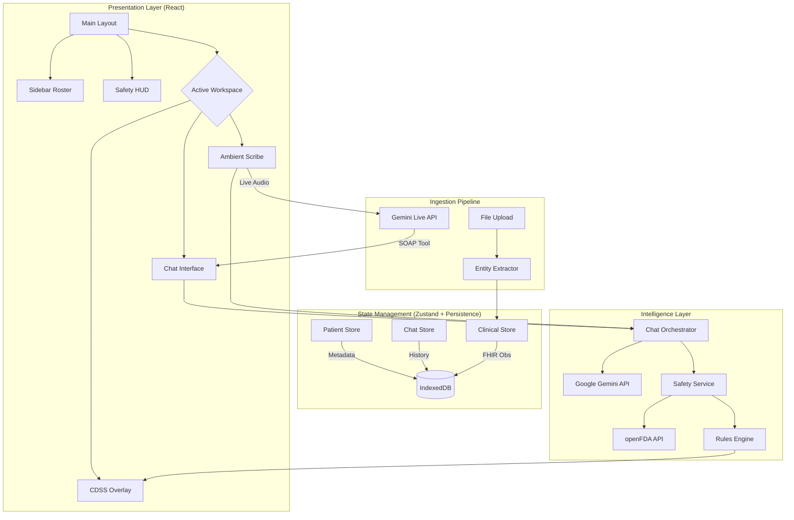

# 🩺 MediBrief - Clinical Intelligence Layer (v5.0)

**MediBrief** is a medical-grade intelligence layer designed to act as a proactive safety partner for healthcare professionals. Unlike standard chatbots, it functions as a **Clinical Decision Support System (CDSS)**, synthesizing raw patient data into structured, actionable artifacts while enforcing strict safety protocols.

It leverages the **Google Gemini 3.0 & 2.5** models for reasoning and **Gemini Live** for real-time voice telemetry, wrapped in a robust, offline-capable React architecture.

---

## 🏗️ System Architecture

MediBrief v5.0 utilizes a **Feature-Based Architecture** with segregated state management for high performance and safety.



---

## 🛡️ The "Zero-Trust" Safety Layer

MediBrief enforces a strict **"Truth Above All"** protocol using a multi-stage verification pipeline:

1.  **Ingestion Scanning**:
    *   Files are scanned by `useEntityExtractor` upon upload.
    *   **Allergies**, **Code Status**, and **Diagnoses** are extracted and pinned to the **Heads-Up Display (HUD)**.

2.  **Pharmacology Guardrails**:
    *   **Human-in-the-Loop**: When medications are detected in text, the user must *verify* the extraction before safety checks run.
    *   **Dual Verification**:
        1.  **Deterministic**: Checks against hard-coded critical limits (e.g., Acetaminophen > 4000mg).
        2.  **External (openFDA)**: Queries the FDA database for **Boxed Warnings** and label contradictions.

3.  **Schema Validation (Zod)**:
    *   All AI outputs (Briefings, Lab Reports) are validated against strict `zod` schemas. Malformed JSON is rejected or auto-repaired before rendering.

---

## 🚀 Key Features

### 1. Multi-Patient Context Switching
*   **Isolated Contexts**: Manage multiple patients simultaneously. Each patient has a dedicated `PatientID` linking their Chat, Documents, and Clinical Data.
*   **IndexedDB Persistence**: Data is stored locally using `idb-keyval`, bypassing the 5MB `localStorage` limit to support high-res images and long histories.

### 2. Clinical Decision Support (CDSS)
*   **Logic Engine**: A dedicated rules engine (`rulesEngine.ts`) monitors the **FHIR Data Store**.
*   **RAG Retrieval**: Retrieves relevant hospital protocols (e.g., Sepsis-3, KDIGO AKI) based on patient data tokens.
*   **Intervention Cards**: High-visibility alerts (Critical/Warning/Info) that overlay the interface when protocols are violated.

### 3. Ambient Scribe Mode
*   **Passive Documentation**: Uses **Gemini Live** to listen to doctor-patient consultations.
*   **Real-Time SOAP**: As the consultation progresses, the model calls the `updateSoapNote` tool to populate a structured note in real-time.
*   **Mobile Optimized**: Features a responsive layout with a sticky audio visualizer and collapsible transcript drawer for phone usage.

### 4. Native Multimodal Ingestion
*   **PACS Viewer**: Specialized image viewer with **Zoom**, **Contrast**, and **Invert (Bone Window)** controls for X-Rays/CTs.
*   **Lab Parsing**: Converts PDF lab reports into structured **FHIR Observations**, enabling automatic trend graphing.

---

## 📂 Project Structure

The codebase follows a strict **Feature-Based** directory structure:

```
src/
├── features/
│   ├── analytics/       # TrendGraph and data visualization
│   ├── cdss/            # Rules engine, Alerts, Protocols
│   ├── chat/            # Message components, Orchestrator hooks
│   ├── clinical/        # FHIR types, Store definition
│   ├── fhir/            # TypeScript definitions for FHIR R4
│   ├── hud/             # Heads-Up Display components
│   ├── layout/          # Main application shell & biometric bg
│   ├── patient/         # Patient metadata store & Roster UI
│   ├── safety/          # Dosage verifier, OpenFDA service
│   ├── scribe/          # Live Scribe interface & session logic
│   └── ui/              # Global UI state (loading, modes)
├── components/          # Shared atomic components (Icons, Toast)
├── services/            # API wrappers (Gemini, BlobStorage)
├── hooks/               # Utility hooks (Audio, DragAndDrop)
└── workers/             # Audio processing workers (PCM)
```

---

## 🛠️ Technical Stack

*   **Frontend**: React 18, Tailwind CSS (Medical Theme).
*   **State**: `zustand` (Split into 4 specialized stores).
*   **Storage**: `idb-keyval` (IndexedDB wrapper).
*   **Validation**: `zod`.
*   **AI**: `@google/genai` (v1.29.1).
*   **Audio**: Web Audio API + AudioWorklet (Low latency PCM).
*   **Data Standard**: FHIR R4 (Partial implementation).

---

## 🚀 Getting Started

1.  **Prerequisites**: Node.js 18+.
2.  **Environment**: Create a `.env` file with `API_KEY=your_gemini_api_key`.
    *   *Note: For the Ambient Scribe, ensure your project has access to the Gemini Live API.*
3.  **Install**: `npm install`
4.  **Run**: `npm start` (or `npm run dev` depending on your script).

**Disclaimer:** *MediBrief is a demonstration of Clinical AI architecture. It is not a certified medical device. All outputs must be verified by a licensed healthcare professional.*
