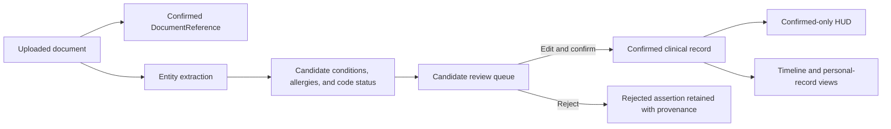

# Candidate Review and Confirmed-Only Views

## Purpose

This document records how MediBrief separates extracted or migrated candidate facts from confirmed patient information in the current Phase 1 implementation.

The central rule is:

> A candidate may be visible in the review queue, but it must not appear as a confirmed allergy, condition, code status, vital, or patient-summary fact until a person accepts it.

## Data flow

The existence of an uploaded file is confirmed because the user explicitly selected and stored it. Clinical claims extracted from that file remain candidates.

## Candidate creation

The current Gemini entity extractor no longer merges extracted strings directly into legacy patient metadata.

It now creates:

- `ConditionRecord` candidates for extracted diagnoses;
- `AllergyIntoleranceRecord` candidates for extracted allergies;
- an `ObservationRecord` candidate for extracted code status;
- a confirmed `DocumentReferenceRecord` for the uploaded local file.

Each candidate contains:

- `verificationStatus: candidate`;
- a stable source-document reference;
- an extraction engine, model, prompt version, and timestamp;
- a deterministic external identity used for conservative same-source deduplication;
- assertion context fields;
- a review note explaining what must be checked.

A repeated extraction from the same source and equivalent entity is deduplicated. A similar statement from a different document remains a separate assertion.

## Review interface

The reusable review interface appears below the active-patient HUD whenever candidates are present.

It supports:

- a patient-scoped review queue;
- resource-type labels and extraction confidence;
- assertion-context visibility;
- editable clinical labels;
- resource-specific fields such as observation value/unit, condition status, allergy criticality, and medication dosage text;
- edit-before-confirm;
- optional review comments;
- confirmation;
- rejection;
- audit logging for edits, confirmation, rejection, and source viewing.

Confirmed and rejected resources remain in the record with their provenance and review history. Reviewed history is not hard-deleted.

## Source preview

When candidate provenance includes a source document, the review interface can open the original locally stored file.

Supported preview behavior:

- images render directly;
- PDFs render in an embedded browser viewer and open at the recorded page when available;
- text and JSON documents render in an embedded frame;
- unsupported types remain downloadable;
- source excerpts, section names, and page numbers remain visible;
- missing local file payloads produce an explicit warning while retaining source metadata.

The preview resolves a source document by either the durable `DocumentReferenceRecord.id` or its stable storage ID.

## Confirmed-only selectors

`features/clinical-record/selectors.ts` centralizes the rules used by patient-facing summaries.

A resource is eligible as a current confirmed patient fact only when:

1. `verificationStatus` is `confirmed`;
2. it is not negated;
3. it is not attributed to a family member;
4. it is not hypothetical.

Additional resource-specific filters apply:

- inactive or resolved allergies do not appear in the active-allergy HUD;
- stopped, completed, not-taken, or entered-in-error medications are not considered active;
- cancelled or entered-in-error observations are excluded;
- vital cards require a known clinical observation date and do not use an unknown fact’s storage timestamp as the measurement time.

## HUD behavior

The active-patient HUD now reads the structured clinical record rather than the legacy diagnosis, allergy, code-status, and observation fields.

It displays only:

- confirmed allergies;
- confirmed active/current conditions;
- confirmed code status;
- confirmed dated vital observations;
- the structured patient display name.

When no allergy has been confirmed, the HUD displays **Allergy status unknown**. It does not display `NKDA`, because the absence of a confirmed allergy record is not evidence that the patient has no allergies.

Legacy candidate facts therefore disappear from the safety badges until reviewed, while remaining available in the candidate queue.

## Reviewed lab observations

The existing lab-verification modal now writes accepted numeric rows into both:

- the legacy observation store, temporarily retained for compatibility;
- the new structured clinical-record store as confirmed observations.

The new observation preserves:

- original value and unit;
- optional normalized value;
- normalization warnings;
- reference range;
- interpretation flag;
- human-confirmation metadata;
- an explicitly unknown clinical date when the report date is unavailable.

The current compatibility rules engine still runs against the legacy copy. Correcting or disabling overclaiming rules remains P1.5 work.

## Compatibility boundary

The patient roster continues to hold lightweight navigation state while the structured profile becomes the durable source for patient-facing clinical summaries.

The old metadata and observation stores remain present during the dual-read transition because backup compatibility and remaining UI features still depend on them. They will not be removed until migration and repository-integrated tests establish that no data is lost.

## Remaining Phase 1 work

P1.5 will correct misleading clinical semantics, including simulated execution language, appointment/task persistence, medication verification wording, current imaging terminology, unvalidated decision-support rules, and remaining unknown-date paths.

P1.6 will add repository-integrated automated coverage for selectors, candidate lifecycle, migration, backup restore, source preservation, unknown dates, and semantic labels.
