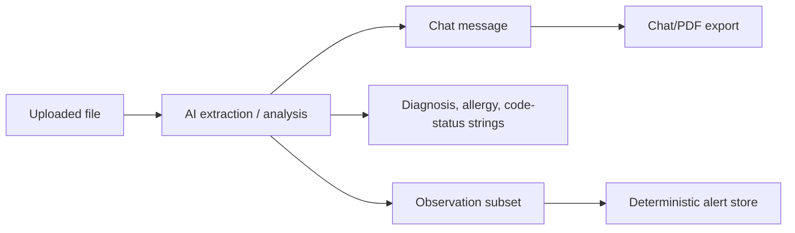
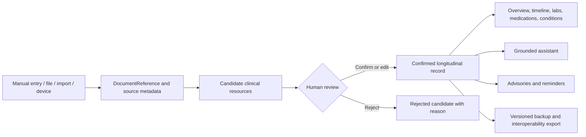
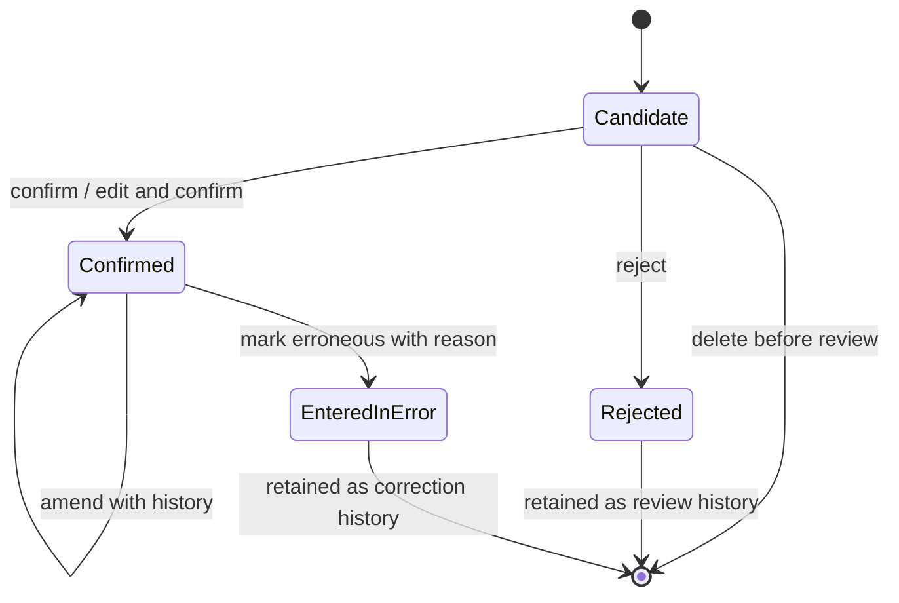

# Clinical Record Foundation Architecture

## Purpose

This document defines MediBrief's Phase 1 transition from lightweight patient metadata, chat history, and an observation-only clinical store into a durable local clinical record.

The new foundation is deliberately **FHIR-inspired, application-owned, local-first, and reviewable**. It does not require a FHIR server, but its resource boundaries, provenance fields, terminology-friendly concepts, and versioned export shape keep future interoperability possible.

## Current flow



The legacy design has three important weaknesses:

1. Chat output often acts as the only durable representation of a clinical event.
2. Extracted facts can be written into patient context without a generic candidate-review lifecycle.
3. Most clinical concepts do not have first-class structured records or provenance.

## Target flow



## Domain boundaries

### Patient roster

The roster remains responsible for fast navigation and lightweight display state. During migration it may keep the current patient name and status fields, but the durable patient profile lives in the clinical record foundation.

### Clinical record

The clinical record owns patient-specific healthcare facts:

- patient profile
- encounters
- conditions
- allergies and intolerances
- medications
- observations
- diagnostic reports
- specimens
- procedures
- immunizations
- appointments
- clinical tasks
- care plans
- document references
- clinical notes

### Chat

Chat remains a communication and explanation interface. It is not a source of truth by itself. A message may link to clinical resources, but deleting or clearing chat must not delete confirmed medical records.

### Advisories

Advisories, reminders, and possible safety findings remain outside the durable clinical-resource aggregate. An advisory may create a proposed task, but it must not claim that treatment, an order, or an appointment was completed unless a durable record actually says so.

## Record aggregate and persistence

`useClinicalRecordStore` owns a patient-scoped aggregate:

```text
records: Record<patientId, PatientClinicalRecord>
```

Each `PatientClinicalRecord` contains one profile and typed collections for all supported resource types. Resources are not mixed with transient alert UI state.

The store persists only the record map under the versioned key:

```text
medibrief-clinical-record-v1
```

Persistence follows the existing MediBrief storage boundary:

1. Zustand serializes the patient record map.
2. `indexedDBStorage` writes it to IndexedDB using the application's existing encryption wrapper.
3. Automatic hydration is disabled with `skipHydration: true`.
4. `SecurityGate` explicitly rehydrates the clinical record store only after setup or successful unlock.
5. Hydrated records are parsed through the strict aggregate schema before entering application state.

An unsupported persistence version fails instead of silently guessing how to transform medical data. Legacy-store migration is a separate Phase 1 slice and will be explicit and testable.

## Write path and validation

Every mutation validates the resulting resource and enclosing patient aggregate before committing state.

Supported lifecycle operations include:

- initialize or replace a patient aggregate
- update the patient profile with amendment history
- add a typed clinical resource
- amend a candidate or confirmed resource
- confirm or reject a candidate
- mark a resource entered in error
- remove an unreviewed candidate
- query resources and build a stable patient timeline

Resource IDs and ownership fields cannot be changed through amendment APIs. A resource that claims another patient ID is rejected by schema validation.

## Resource lifecycle



Every resource has a `verificationStatus`:

- `candidate` — extracted or suggested, not yet part of the trusted summary
- `confirmed` — manually entered or reviewed and accepted
- `rejected` — reviewed and intentionally excluded
- `entered-in-error` — previously stored but later determined to be wrong

Clinical status remains separate. For example, a confirmed condition can be active, resolved, inactive, or in remission.

Reviewed resources are protected from hard deletion. Confirmed records are corrected by amendment or by marking them entered in error. Rejected and entered-in-error resources remain immutable review history.

## Candidate duplicate policy

Candidate deduplication is intentionally conservative. MediBrief compares candidates only when they share a stable source identity:

- the same external system and external ID, or
- the same source document plus page, section, offsets, or excerpt

The source identity is combined with resource-specific clinical fields. Similar facts from different documents are not merged automatically because they may represent separate events, repeated measurements, or changed clinical states.

Callers can explicitly allow a duplicate candidate when preserving two independent source assertions is intentional.

## Query and timeline policy

The store can filter resources by:

- patient
- resource type
- verification status
- source kind
- source document
- external system and external ID
- clinical date range

Patient timelines default to confirmed resources. Candidate, rejected, and entered-in-error resources must be explicitly requested.

Timeline ordering uses the most relevant clinical date for each resource type, such as encounter period, condition onset, specimen collection, immunization occurrence, appointment start, document authored date, or note authored time. Ties are resolved deterministically by recorded time, type, and ID.

When a clinical event date is unknown, `recordedAt` may provide a stable display fallback, but the resource is marked as using that fallback. It is never treated as occurring inside a clinical date range unless unknown dates are explicitly included.

## Date policy

Clinical dates support day, month, year, or unknown precision.

- Unknown dates use `value: null` and `precision: "unknown"`.
- The application must never replace a missing report or event date with the current date.
- Original ambiguous date text can be retained in `sourceText`.
- Full operational timestamps such as creation, review, and upload times use date-time strings.
- Date-range queries use interval overlap so a year-only or month-only fact can still be found correctly.

## Value policy

Numeric clinical values preserve both forms:

- `original` — exactly what was captured from the source
- `normalized` — an optional converted value used for trends or validated rules

Normalization warnings are stored with the value. The original value is never overwritten.

## Provenance policy

Each resource records:

- source kind
- source document and source span when available
- creation and update timestamps
- extraction engine, model, and version when applicable
- extraction confidence when available
- confirmation or rejection metadata
- amendment history with changed fields and previous values

Confidence is model confidence, not clinical certainty. Clinical certainty is stored separately in assertion context.

## Assertion context

Extracted concepts can preserve:

- polarity: affirmed, negated, unknown
- certainty: certain, uncertain, unknown
- temporality: current, historical, hypothetical, unknown
- experiencer: patient, family, other, unknown

A family-history concept, negated finding, or hypothetical condition must not silently become an active patient condition.

## Compatibility inventory

| Current component | Current dependency | Phase 1 transition |
|---|---|---|
| `features/patient-management/usePatientStore.ts` | Patient name, age, weight, sex, diagnosis/allergy strings, documents | Keep roster navigation temporarily; migrate durable demographics and clinical facts into `PatientClinicalRecord`. |
| `features/clinical-analysis/stores/useClinicalStore.ts` | Observations, active alerts, dismissal history | Replace observation storage with the new record store. Keep advisories in a separate transient/advisory store. |
| `features/layout/MainLayout.tsx` | Lab verification writes FHIR subset observations and runs rules | Confirm a diagnostic-report transaction containing report, specimen, and observation resources; do not invent unknown dates. |
| `features/hud/HeadsUpDisplay.tsx` | Reads patient strings and observation subset | Read only confirmed allergies, conditions, code-status representation, and observations from the clinical record. |
| `features/patient-roster/SidebarRoster.tsx` | Composite legacy backup and restore | Introduce backup v2 containing complete records, provenance, amendments, and candidates; retain legacy import migration. |
| `features/chat/hooks/useChatOrchestrator.ts` | Upload analysis, document metadata, lab quarantine | Create a durable `DocumentReferenceRecord`, then attach extraction candidates and source links. |
| `hooks/useEntityExtractor.ts` | Automatically merges extracted strings into patient metadata | Change to candidate creation only. Confirmation is required before summaries use extracted facts. |
| `features/clinical-analysis/entityExtractionService.ts` | LLM extraction of allergy/code-status/diagnosis | Later replace or supplement with OpenMed; return assertion-aware candidates rather than direct patient updates. |
| `features/scribe/ScribeInterface.tsx` | Saves formatted SOAP content into chat | Save a versioned `ClinicalNoteRecord`; chat may display a link or summary. |
| `features/cdss/CDSSContainer.tsx` | Dismisses alerts and writes `ACTION EXECUTED` chat messages | Separate suggestion, acknowledgement, task creation, and actual completion. |
| `features/chat/components/Message.tsx` | Displays medication result as external verification | Reword as limited label/coverage information and link results to structured medication records when available. |
| `features/analytics/TrendGraph.tsx` | Graphs observation subset by exact text | Trend confirmed observations by code where possible, preserve original units, and use normalized values only when valid. |
| `features/fhir/types.ts` | Small Observation-only FHIR subset | Keep temporarily as a legacy adapter; the new domain becomes the primary internal model. |

## Transition strategy

1. Add the new domain contracts and validation schemas without changing UI behavior. **Complete.**
2. Add a versioned clinical-record store beside the legacy stores. **Complete.**
3. Add migration adapters from current patient metadata, documents, and observations.
4. Add strict backup v2 export and backward-compatible restore.
5. Dual-read during the transition, preferring the new record when present.
6. Move each feature to the new store one at a time.
7. Remove legacy clinical fields only after migration and backup compatibility are tested.

## Invariants

The implementation must maintain these rules:

1. Resource IDs are stable.
2. Every resource belongs to exactly one patient.
3. Extracted facts default to candidate, not confirmed.
4. Manually entered facts can be confirmed at creation.
5. Unknown dates remain unknown.
6. Original clinical values are immutable through normalization.
7. Amendments preserve previous values and do not erase history.
8. Rejected candidates do not appear in confirmed patient summaries.
9. Reviewed clinical history is not hard-deleted.
10. Clearing chat does not clear the clinical record.
11. Advisories are not stored as confirmed facts.
12. A suggestion, acknowledgement, task, appointment, order, and completed action are distinct states.
