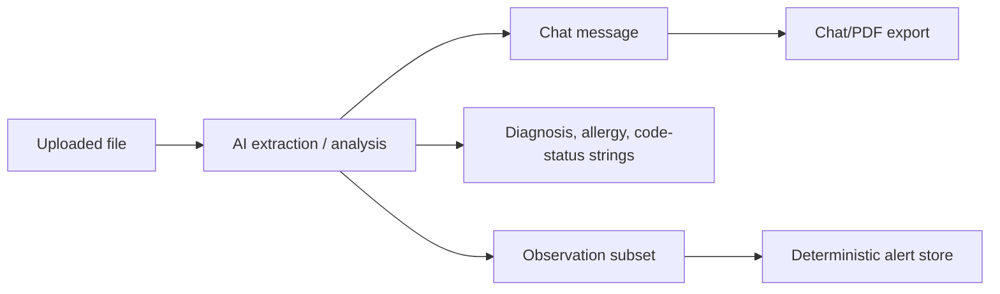
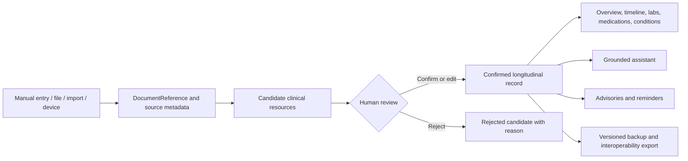
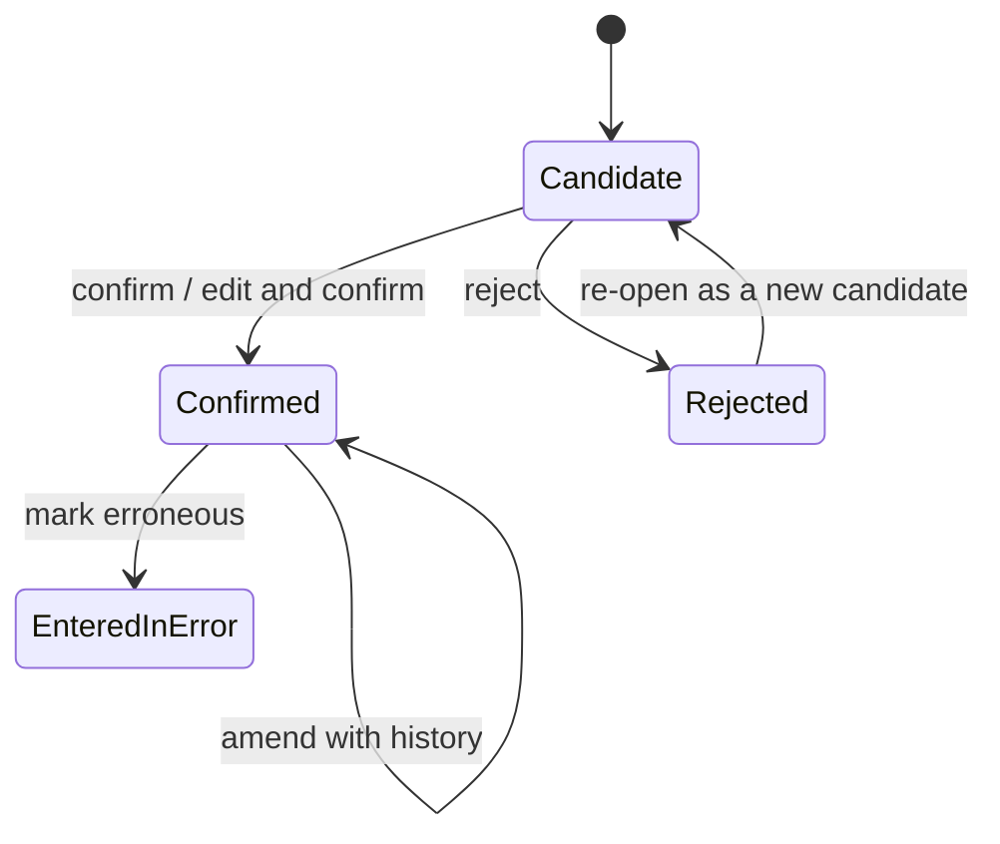

# Clinical Record Foundation Architecture

## Purpose

This document defines the Phase 1 transition from MediBrief's current patient metadata, chat history, and observation store into a durable local clinical record.

The new foundation is deliberately **FHIR-inspired, application-owned, and local-first**. It does not require a FHIR server, but its resource boundaries and terminology-friendly fields make future import/export possible.

## Current flow

The current design has three important weaknesses:

1. Chat output often acts as the only durable representation of a clinical event.
2. Extracted facts can be written into patient context without a generic candidate-review lifecycle.
3. Most clinical concepts do not have first-class structured records or provenance.

## Target flow

## Domain boundaries

### Patient roster

The roster remains responsible for fast navigation and lightweight display state. During migration it may keep the current patient name and status fields, but the durable patient profile will live in the clinical record foundation.

### Clinical record

The clinical record owns patient-specific healthcare facts:

- patient profile
- encounters
- conditions
- allergies and intolerances
- medications
- observations
- diagnostic reports
- specimens
- procedures
- immunizations
- appointments
- clinical tasks
- care plans
- document references
- clinical notes

### Chat

Chat remains a communication and explanation interface. It is not a source of truth by itself. A message may link to clinical resources, but deleting or clearing chat must not delete confirmed medical records.

### Advisories

Advisories, reminders, and possible safety findings are separate from confirmed clinical facts. An advisory may create a proposed task, but it must not claim that treatment, an order, or an appointment was completed unless a durable record actually says so.

## Resource lifecycle

Every resource has a `verificationStatus`:

- `candidate` — extracted or suggested, not yet part of the trusted summary
- `confirmed` — manually entered or reviewed and accepted
- `rejected` — reviewed and intentionally excluded
- `entered-in-error` — previously stored but later determined to be wrong

Clinical status remains separate. For example, a confirmed condition can be active, resolved, inactive, or in remission.

## Date policy

Clinical dates support day, month, year, or unknown precision.

- Unknown dates use `value: null` and `precision: "unknown"`.
- The application must never replace a missing report or event date with the current date.
- Original ambiguous date text can be retained in `sourceText`.
- Full operational timestamps such as creation, review, and upload times use date-time strings.

## Value policy

Numeric clinical values preserve both forms:

- `original` — exactly what was captured from the source
- `normalized` — an optional converted value used for trends or validated rules

Normalization warnings are stored with the value. The original value is never overwritten.

## Provenance policy

Each resource records:

- source kind
- source document and source span when available
- creation and update timestamps
- extraction engine/model/version when applicable
- extraction confidence when available
- confirmation or rejection metadata
- amendment history

Confidence is model confidence, not clinical certainty. Clinical certainty is stored separately in assertion context.

## Assertion context

Extracted concepts can preserve:

- polarity: affirmed, negated, unknown
- certainty: certain, uncertain, unknown
- temporality: current, historical, hypothetical, unknown
- experiencer: patient, family, other, unknown

A family-history concept, negated finding, or hypothetical condition must not silently become an active patient condition.

## Compatibility inventory

| Current component | Current dependency | Phase 1 transition |
|---|---|---|
| `features/patient-management/usePatientStore.ts` | Patient name, age, weight, sex, diagnosis/allergy strings, documents | Keep roster navigation temporarily; migrate durable demographics and clinical facts into `PatientClinicalRecord`. |
| `features/clinical-analysis/stores/useClinicalStore.ts` | Observations, active alerts, dismissal history | Replace observation storage with the new record store. Keep advisories in a separate transient/advisory store. |
| `features/layout/MainLayout.tsx` | Lab verification writes FHIR subset observations and runs rules | Confirm a diagnostic report transaction containing report, specimen, and observation resources; do not invent unknown dates. |
| `features/hud/HeadsUpDisplay.tsx` | Reads patient strings and observation subset | Read only confirmed allergies, conditions, code-status representation, and observations from the clinical record. |
| `features/patient-roster/SidebarRoster.tsx` | Composite legacy backup and restore | Introduce backup v2 containing complete records, provenance, amendments, and candidates; retain legacy import migration. |
| `features/chat/hooks/useChatOrchestrator.ts` | Upload analysis, document metadata, lab quarantine | Create a durable `DocumentReferenceRecord`, then attach extraction candidates and source links. |
| `hooks/useEntityExtractor.ts` | Automatically merges extracted strings into patient metadata | Change to candidate creation only. Confirmation is required before summaries use extracted facts. |
| `features/clinical-analysis/entityExtractionService.ts` | LLM extraction of allergy/code-status/diagnosis | Later replace or supplement with OpenMed; return assertion-aware candidates rather than direct patient updates. |
| `features/scribe/ScribeInterface.tsx` | Saves formatted SOAP content into chat | Save a versioned `ClinicalNoteRecord`; chat may display a link or summary. |
| `features/cdss/CDSSContainer.tsx` | Dismisses alerts and writes `ACTION EXECUTED` chat messages | Separate suggestion, acknowledgement, task creation, and actual completion. |
| `features/chat/components/Message.tsx` | Displays medication result as external verification | Reword as limited label/coverage information and link results to structured medication records when available. |
| `features/analytics/TrendGraph.tsx` | Graphs observation subset by exact text | Trend confirmed observations by code where possible, preserve original units, and use normalized values only when valid. |
| `features/fhir/types.ts` | Small Observation-only FHIR subset | Keep temporarily as a legacy adapter; the new domain becomes the primary internal model. |

## Transition strategy

1. Add the new domain contracts and validation schemas without changing UI behavior.
2. Add a versioned clinical-record store beside the legacy stores.
3. Add migration adapters from current patient metadata, documents, and observations.
4. Dual-read during the transition, preferring the new record when present.
5. Move each feature to the new store one at a time.
6. Remove legacy clinical fields only after migration and backup compatibility are tested.

## Invariants

The implementation must maintain these rules:

1. Resource IDs are stable.
2. Every resource belongs to exactly one patient.
3. Extracted facts default to candidate, not confirmed.
4. Manually entered facts can be confirmed at creation.
5. Unknown dates remain unknown.
6. Original clinical values are immutable through normalization.
7. Amendments preserve previous values and do not erase history.
8. Rejected candidates do not appear in confirmed patient summaries.
9. Clearing chat does not clear the clinical record.
10. A suggestion, acknowledgement, task, appointment, order, and completed action are distinct states.
